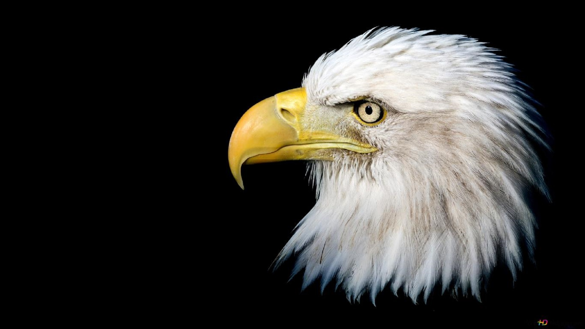

# 🐦 Animated Bird Slider

Welcome to the **Animated Bird Slider**, a visually engaging and fully responsive image carousel that highlights the elegance of nature's most captivating birds — from majestic eagles to vibrant parrots.

> 🎯 Perfect for showcasing animation, interactivity, and modern front-end techniques.

---

## 🔥 Live Demo
👉 [Click here to view the project in action]([http://127.0.0.1:5501/index.html])  

---

## 🚀 Key Features

- ⚡ Smooth slide transition with auto-play and manual controls
- 🎨 Clean, responsive UI using HTML, CSS3, and vanilla JavaScript
- 🧠 Dynamic DOM manipulation & animation logic
- 🖼️ Vivid bird photography with descriptive overlays
- ⏱️ Animated progress bar for slide timing

---

## 🛠️ Technologies Used

- HTML5
- CSS3 (with custom animations)
- JavaScript (vanilla)
- Responsive design principles

---

## 💡 What I Learned

- DOM traversal and manipulation for dynamic sliders
- Creating responsive designs that adapt to any screen
- Handling timed animations and transitions smoothly
- Writing scalable and organized front-end code

---

## 👨‍💻 About Me

Hi! I'm **Kavin S**, a passionate front-end developer and aspiring software engineer.  
I love building interactive UI projects that combine design and code to create smooth user experiences.

- 📫 **Email**: senthilkavin1972@gmail.com  
- 🌐 **Portfolio**: 
- 💼 **Looking for**: Internships | Freelance Projects | Entry-level Developer Roles  

---

## 📸 Screenshots

---

## 📂 Project Structure

